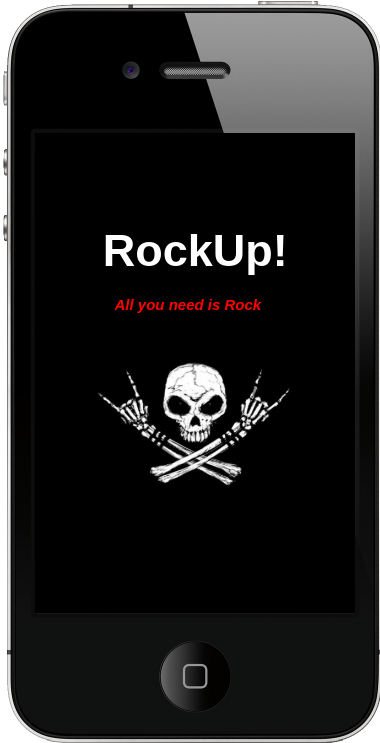
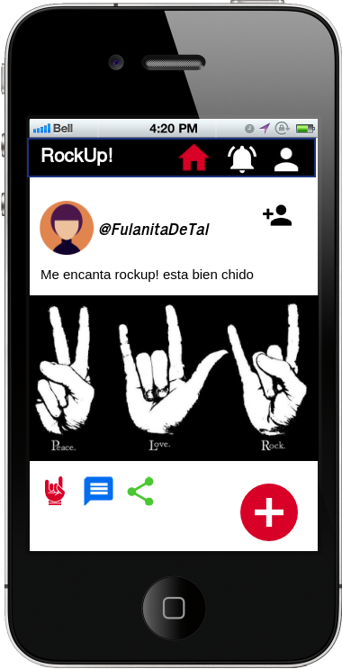
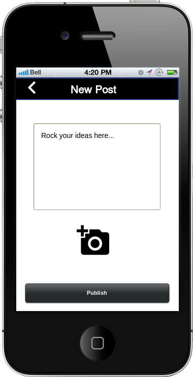
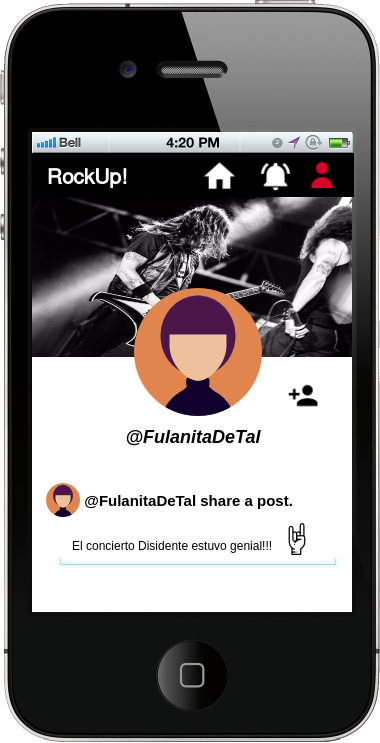
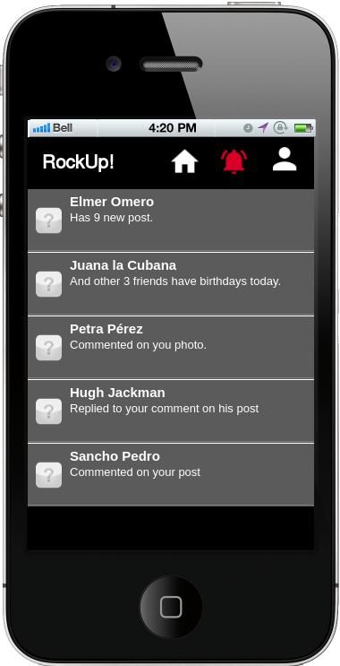
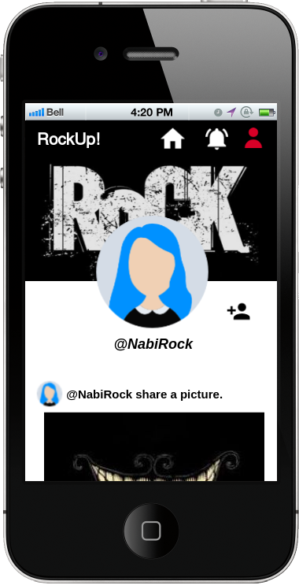

# RockUp!

Nota: A quien corresponda revisar proyecto, pueden acceder por medio de esta cuenta.
correo: guscor@gmail.com
password: 1234567

## Introducción.

RockUp! Es una red social diseñada para los amantes del Rock, en donde todos sus usuarios podrán compartir post acerca de sus bandas favoritas, eventos, noticias, modas, canciones y mucho más.

### Problemática.

Después de un largo proceso de investigación nos dimos cuenta de un problema importante entre los prospecto a usuarios de RockUp! Dicho problema es que cada vez es mas difícil para las nuevas bandas de rock hacerse un camino en su carrera musical.

Hoy en día existen un sin fin de artistas con proyectos musicales de muy buena calidad, y una de las situaciones mas difíciles a las que se enfrentan es, por supuesto, “darse a conocer”, este proceso lleva mucho tiempo y ademas la publicidad puede ser muy costosa.

Al darnos cuenta de esta problemática, RockUp! Esta diseñada para ser una plataforma ideal en donde todas las bandas y artistas, podrán publicar sus eventos, compartir sus creaciones, organizar eventos y mas, todo en una red social ya clasificada para las personas que gustan del rock. 

RockUp! Sera un espacio que brinda empuje y publicidad gratuita, para expandir proyectos independientes con el fin de que todas las creaciones de bandas y artistas lleguen a los oídos de los espectadores mas críticos y publico en general.

Con RockUp! Podrás crear tu perfil. Ver publicaciones de eventos, escribir post, subir y compartir fotos y hacer amigos con tus mismos gustos musicales. El rock nos une! 

A continuación se presenta el flujo de nuestra red social y algunas de sus funciones en esta primera etapa de desarrollo.

## Desarrollo.

#### Flujo de aplicación.

Después de una splash-screen de 2 segundos se muestra la red social en su apartado de "home".

Dentro del apartado de "Home" podrás ver las publicaciones de las personas que se encuentran en la red, podrás darle "add" para seguir nuevos usuarios, ver los post de tus "amigos" que sigues, así como darles un "me rockea", comentar y compartir sus post.

Al dar click en el icono de "+", podrás hacer una publicación que incluya texto, fotografía o bien, los dos! :D

Al dar click en el nombre de un usuario podrás ver su perfil.

Tendrás un apartado de Notificaciones al dar click en el icono de campana. No te pierdas ninguna!!!Tus amigos siempre estarán rockeando contigo.

Tendrás tu propio perfil en donde compartirás tus gustos, fotografías, "news", eventos, conciertos y muchas otras cosas que quieras compartir. ¡ERES LIBRE DE ELEGIR LO QUE QUIERES QUE EL MUNDO SEPA DE TI!.

## ENCUESTAS

Preguntamos a nuestros prospectos a Usuarios que pensaban de nuestra primera versión de RockUp! Estas fueron las opiniones que obtuvimos:

#### Sandra Rodríguez. 
##### Rockera de corazón desde hace 10 años.

¡Me encanta RockUp! Es una app muy divertida en donde puedo compartir todo acerca de mis bandas favoritas! Me encanta que a todos los usuarios nos guste el Rock y aun que hay muchos tipos de Rock, siempre encontraremos algo en común.

#### Israel Zapata.
##### Apasionado rockero fan de Metallica.

RockUp! Esta de poca madre!!! Viva el Rock!

#### Amy Lee.
##### Importante cantante de popular banda de Rock.

Gracias a RockUp! He conseguido millones de seguidores! 

## Conclusión.

Creemos que RockUp! Tendrá un gran alcance y pronto seremos la red social entre usuarios amantes del rock más grande e importante del mundo. 

Únete a RockUp!

